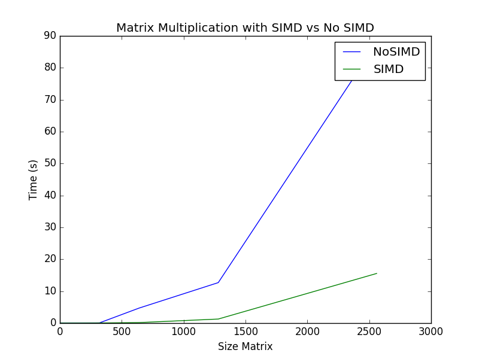
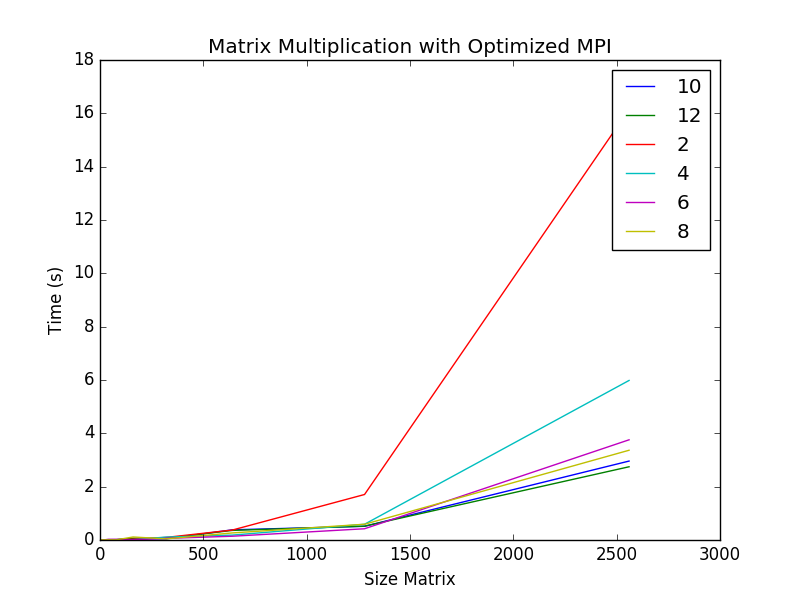
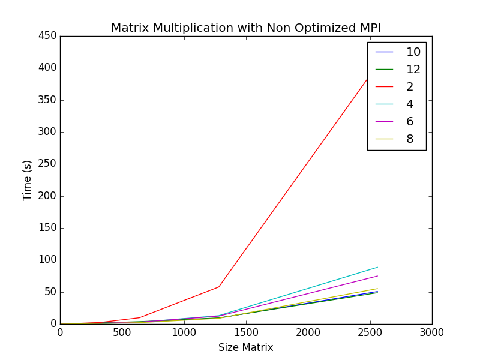
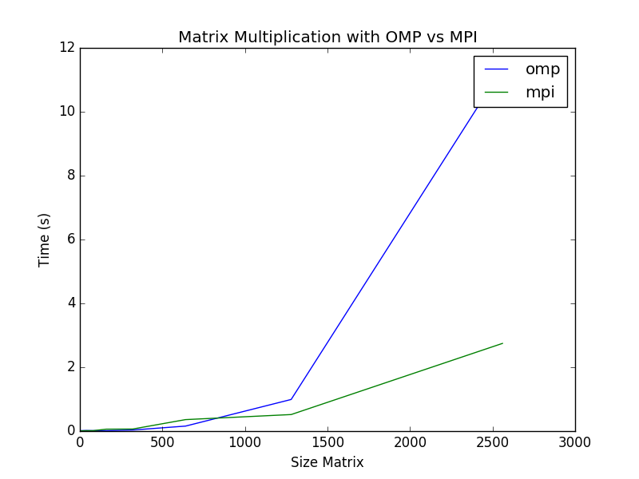
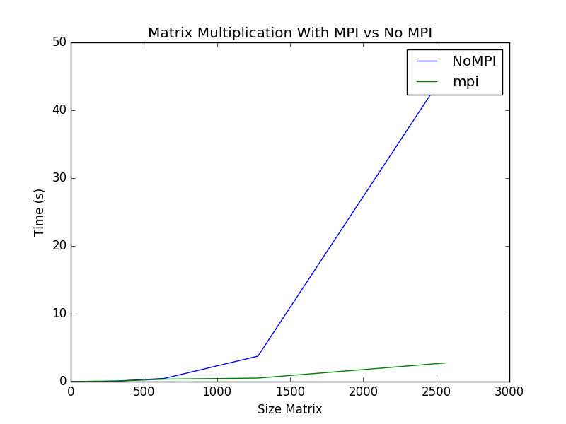
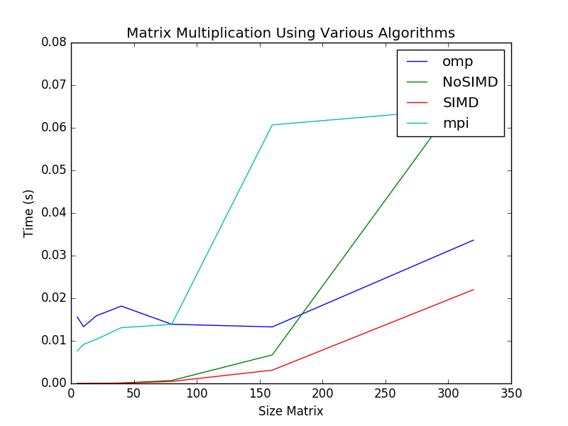
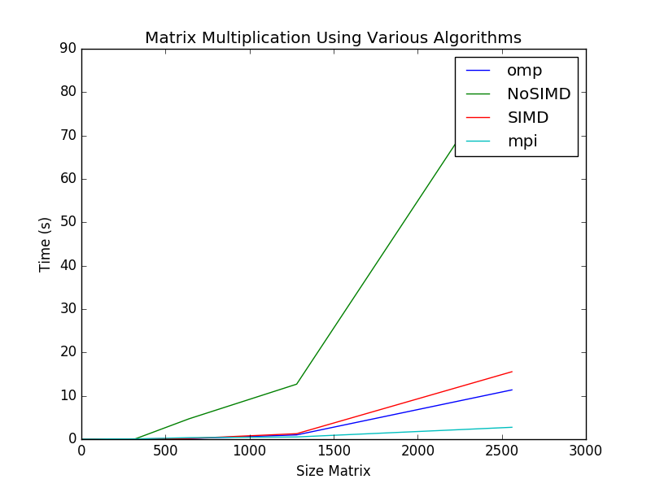

# matrix-04-elseify-adams-photis Lab 6 - Parallel Computing

## Matrix multiplication in C on Wolfgand cluster without parallelization
   For matrix multiplication without parallelization, we created a new file named mmult2.c and in this file created a function similar to the SIMD algortithm. The algorithm without parallelization is a standard matrix multiplication algorithm that uses 3 for loops. 
   The picture below shows a graph with the correlation of runtimes between a non parallelized algorithm and the SIMD algorithm.
    
## Matrix multiplication in C on Wolfgand cluster with  SIMD (rewrite algo accordingly and try with and without -O3)
   
   
## Matrix multiplication in C on Wolfgand cluster with  OpenMP (easy, try mmult_omp_timing)
Called the file mmult_omp.c with the method mmult_omp to multiply the two matrices we generated in mmult_mpi_omp.c to test matrix multiplication using omp.
    
## Matrix multiplication in C on Wolfgand cluster with MPI (Distribitued Memory)
For this algorithm, we broadcast the matrix b to all of the slave nodes. From there, we send as many rows as we have slaves to the slave nodes where we perform a matrix multiplication of a vector times a matrix. For each row we send, we receive a response back to the master, where we update cc1 accordingly. If we haven't sent enough rows, we keep sending to the slave nodes until all rows have been processed.
   
# Additional Tasks
 
  
## Matrix multiplication parallelization in Java on your own computer (SIMD, SMP or other). 
I used the algorithm with four for loops in java to accomplish SIMD in java. This algorithm multiplies each value in matrix a by a row in matrix b and will increment each value in matrix c. 

## Automate the production of graph with  Gnuplot or other tools.
Using Python, we were able to create a script that generates a plot from the run files we produced in our experiments. The run.sh file on the Wolfgand cluster generates run files in the format of run-{matrix_size}-{label}, sends them up to linux2 (the cluster doesn't have matplotlib available), and from linux2 we run the plot script on those files.

# Full Project Cycle
For the cycle of our project, we started out by creating all the tasks we needed to complete on Trello. Once our group had a visual of what needed to be done, we began the project by various meetings at the tech to discuss implementation for certain Trello tasks. 

Finishing a task incorporated writing and changing code in the given files. After running and debugging, our group came up with solutions to the Trello tasks.

To test how our algorithms worked, the base step was actually writing out in hand what we thought our algorithm was doing. We also looked at algorithm speed and used this to figure out that we were actually solving the problem incorrectly due to wrong speed outputs. Meetings with TA’s and with group members helped correct the path we were on to fix certain issues.

When we first began the lab, we changed the input to certain matrices so we could see if the algorithm was working correctly. Once we figured that out, we used code to generate matrices.

We used a batch script that carries out the experiments by producing run files used with a combination of different nodes and different size matrices. The bash script sends the files up to linux2 where the python script will take the run files and generate plots from them.

  
  
  
# Team work

## Tarek Elseify
- Run matrix multiplication on different size matrices and different number of nodes automatically
- Automated plotting using Python and matplotlib
- Assisted in developing matrix multiplication with MPI
- Produced graphs

## Alexander Photis
- Implemented matrix multiplication without parallelization
- Assisted in developing matrix multiplication with MPI
- Set meetings times to discuss project

## Zach Adams
- Developed SIMD in java on my own system.
- Implemented openMP on wolfgang cluster
- Assisted in developing matrix multiplication with MPI
